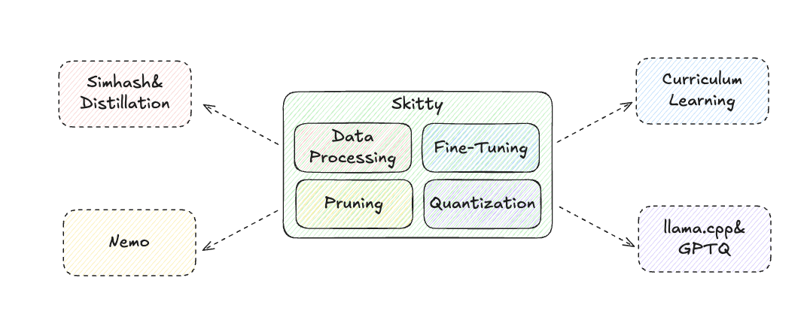

# skitty : 스팸 문자 필터링 On-device LLM

<p align="center">
  
</p>

Skitty is an all-in-one on-device LLM for spam SMS filtering, explanation, and efficient deployment through pruning and quantization.


Skitty는 다양한 스팸 문자를 필터링하고, 왜 스팸으로 분류되었는지를 간단하게 설명할 수 있는 설명가능한 sLLM 입니다.

온디바이스 환경에서도 동작할 수 있도록 미세조정(Fine-tuning), Pruning, 양자화(Quantization) 과정을 거쳐 경량화하였으며, 실시간으로 안전하고 빠른 스팸 탐지를 지원합니다.

📌 Skitty의 주요 특징
- 📩 스팸 문자 필터링(최신 스팸 패턴 학습(2025 데이터셋 반영))
- 💡 설명가능한 AI (XAI)(단순히 스팸 여부만 알려주는 것이 아니라, 스팸으로 분류한 이유를 설명하는 AI)
- ⚡ 온디바이스 최적화(**Pruning(20~30%)**과 양자화(GPTQ, GGUF Q4_K_M) 적용)

Skitty is built with Python 3.12+, [Hugging Face Transformers](https://github.com/huggingface/transformers), [Sentence Transformers](https://github.com/UKPLab/sentence-transformers) and [FastAPI](https://github.com/tiangolo/fastapi). Apache 2.0 license.

### 프로젝트 환경 구축
```
# UV 설치 
curl -LsSf https://astral.sh/uv/install.sh | sh

# 추가 환경변수 설정
export PATH="$HOME/.cargo/bin:$PATH"
source ~/.bashrc  # 또는 source ~/.zshrc

# nvcc 설치(클라우드 서비스 이용 시 설치!!)
wget https://developer.download.nvidia.com/compute/cuda/repos/ubuntu2204/x86_64/cuda-keyring_1.0-1_all.deb
sudo dpkg -i cuda-keyring_1.0-1_all.deb
sudo apt update
sudo apt install cuda-toolkit-12-2

# nvcc 추가 환경 변수 설정(클라우드 서비스 이용 시 설치!!)
echo $PATH
export PATH=$PATH:/usr/local/cuda-12.2/bin
echo $PATH | grep cuda

# 프로젝트 패키지 설치(현재는 데이터 전처리에 대한 패키지만 존재, 파인튜닝 시 추가 설치 패키지는 src/config/config.md에 기록)
uv sync
```
---

# 1. 프로젝트 구조
### `src/data`
- 스팸 문자 데이터셋 전처리 및 정제
- 중복 제거, 라벨링, 데이터 검증 로직
- 훈련/검증/테스트 데이터 분할 관리

### `src/optimizer`
- Pruning 알고리즘 구현 (구조적/비구조적 가지치기)
- 양자화 모듈 (GPTQ, GGUF Q4_K_M 지원)
- 모델 압축 및 최적화 유틸리티

### `src/utils`
- 공통 유틸리티 함수 및 헬퍼 모듈

### `src/configs`
- YAML 기반 설정 파일 관리
- 훈련 하이퍼파라미터 및 모델 설정
- 평가 및 배포 환경별 구성 정의

### `eval`
- 모델 성능 평가 스크립트
- Extract Match 및 LLM as a Judge 평가 방법론

### `test`
- 단위 테스트 및 통합 테스트
- 데이터 전처리 파이프라인 테스트
- 모델 훈련 및 추론 기능 검증
---
# 2. 프로젝트 실행 및 테스트
1. 데이터 전처리 실행
```
sh ./run_data_pipeline.py
```
2. 파인튜닝 실행(클라우드에서만 수행가능) 
```
sh ./run_train.sh
- 추후 apple 실리콘 환경에서의 학습 코드 추가 예정
```
3. 테스트 코드 실행
```
sh ./pytest.sh
- 현재는 data 전처리에 대한 pytest 코드만 존재
```
