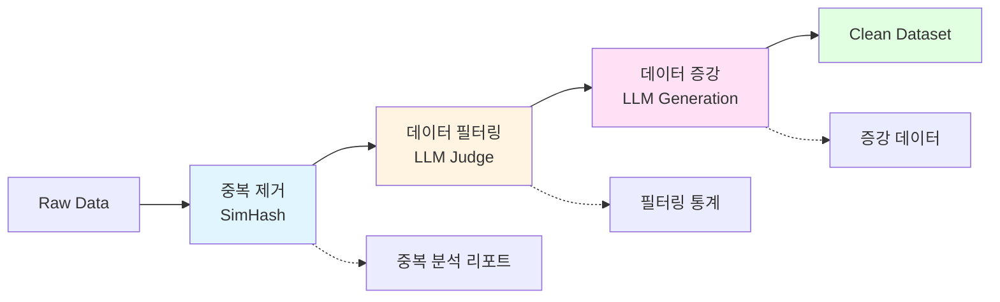

# skitty : 스팸 문자 필터링 On-device LLM

<p align="center">
  
</p>

Skitty is an all-in-one on-device LLM for spam SMS filtering, explanation, and efficient deployment through pruning and quantization.


Skitty는 다양한 스팸 문자를 필터링하고, 왜 스팸으로 분류되었는지를 간단하게 설명할 수 있는 설명가능한 sLLM 입니다.

온디바이스 환경에서도 동작할 수 있도록 미세조정(Fine-tuning), Pruning, 양자화(Quantization) 과정을 거쳐 경량화하였으며, 실시간으로 안전하고 빠른 스팸 탐지를 지원합니다.

📌 Skitty의 주요 특징
- 📩 스팸 문자 필터링(최신 스팸 패턴 학습(2025 데이터셋 반영))
- 💡 설명가능한 AI (XAI)(단순히 스팸 여부만 알려주는 것이 아니라, 스팸으로 분류한 이유를 설명하는 AI)
- ⚡ 온디바이스 최적화(**Pruning(20~30%)**과 양자화(GPTQ, GGUF Q4_K_M) 적용)

Skitty is built with Python 3.12+, [Hugging Face Transformers](https://github.com/huggingface/transformers), [Sentence Transformers](https://github.com/UKPLab/sentence-transformers) and [FastAPI](https://github.com/tiangolo/fastapi). Apache 2.0 license.

### 프로젝트 환경 구축
```
# UV 설치 
curl -LsSf https://astral.sh/uv/install.sh | sh

# 추가 환경변수 설정
export PATH="$HOME/.cargo/bin:$PATH"
source ~/.bashrc  # 또는 source ~/.zshrc

# nvcc 설치(클라우드 서비스 이용 시 설치!!)
wget https://developer.download.nvidia.com/compute/cuda/repos/ubuntu2204/x86_64/cuda-keyring_1.0-1_all.deb
sudo dpkg -i cuda-keyring_1.0-1_all.deb
sudo apt update
sudo apt install cuda-toolkit-12-2

# nvcc 추가 환경 변수 설정(클라우드 서비스 이용 시 설치!!)
echo $PATH
export PATH=$PATH:/usr/local/cuda-12.2/bin
echo $PATH | grep cuda

# 프로젝트 패키지 설치(현재는 데이터 전처리에 대한 패키지만 존재, 파인튜닝 시 추가 설치 패키지는 src/config/config.md에 기록)
uv sync
```
---

# 1. 프로젝트 구조

```
skitty/
├── src/
│   ├── config/              # 환경 설정 관리
│   │   └── env_config.py    # 환경 변수 및 설정 파일 관리
│   │
│   ├── data/                # 데이터 처리 계층
│   │   ├── constants.py     # 데이터 관련 상수 정의
│   │   ├── data_dedup.py    # 중복 제거 (SimHash 기반)
│   │   ├── data_filtering.py # 데이터 필터링 (LLM 기반 품질 검증)
│   │   ├── data_augmentation.py # 데이터 증강 (LLM 기반)
│   │   └── utils/           # 데이터 처리 유틸리티
│   │       ├── io.py        # DataFrame 입출력 처리
│   │       └── normalize.py # 텍스트 정규화
│   │
│   ├── service/             # 비즈니스 로직 계층
│   │   └── data_pipeline.py # 데이터 파이프라인 오케스트레이션
│   │
│   ├── optimizer/           # 모델 최적화
│   │   └── quantize.py      # 양자화 (GPTQ, GGUF Q4_K_M 지원)
│   │
│   └── utils/               # 공통 유틸리티
│       ├── log.py           # 로깅 및 성능 측정
│       ├── enum.py          # Enum 타입 정의
│       └── exception.py     # 예외 처리
│
├── eval/                    # 모델 평가
│   └── evaluation.py        # LLM Judge 기반 평가
│
├── tests/                   # 테스트 코드 (88개 테스트)
│   ├── unit/                # 단위 테스트
│   │   ├── test_data_dedup_io.py
│   │   ├── test_data_filtering.py
│   │   ├── test_data_argumentation.py
│   │   ├── test_data_pipeline.py
│   │   └── test_evaluation.py
│   └── integration/         # 통합 테스트
│       ├── test_data_integration.py
│       └── test_eval_integration.py
│
└── scripts/                 # 실행 스크립트
    ├── run_data_pipeline.sh # 데이터 전처리 파이프라인
    ├── run_train.sh         # 모델 파인튜닝
    ├── run_evaluate.sh      # 모델 평가
    ├── run_quantize.sh      # 모델 양자화
    ├── run_merge.sh         # LoRA 어댑터 병합
    ├── run_upload.sh        # 모델 업로드
    ├── run_vllm_server.sh   # vLLM 서버 실행
    └── run_pytest.sh        # 테스트 실행
```

## 주요 모듈 설명

### 📦 `src/data` - 데이터 처리 계층
리팩토링을 통해 데이터 처리 로직을 명확하게 분리했습니다:
- **`data_dedup.py`**: SimHash 알고리즘 기반 중복 제거
  - `DuplicateFinder`: 텍스트 유사도 기반 중복 탐지
  - `SimhashGenerator`: SimHash 생성 및 인덱싱
- **`data_filtering.py`**: LLM 기반 데이터 품질 검증
  - Gemini/OpenAI API를 활용한 스팸 데이터 필터링
  - 비동기 배치 처리로 성능 최적화
- **`data_augmentation.py`**: LLM 기반 데이터 증강
  - 다양한 스팸 패턴 생성으로 모델 일반화 성능 향상
- **`utils/`**: 데이터 처리 공통 모듈
  - `io.py`: Polars 기반 고성능 DataFrame 처리
  - `normalize.py`: 텍스트 정규화 (URL, 숫자, 특수문자 처리)

### 🔧 `src/service` - 비즈니스 로직 계층
- **`data_pipeline.py`**: 전체 데이터 처리 파이프라인 오케스트레이션
  - 중복 제거 → 필터링 → 증강 단계를 순차적으로 실행
  - 각 단계별 선택적 실행 가능
  - 파이프라인 상태 모니터링 기능

### ⚙️ `src/optimizer` - 모델 최적화
- **`quantize.py`**: 모델 양자화 (GPU 환경 필요)
  - GPTQ 4-bit 양자화 지원
  - GGUF Q4_K_M 변환 지원

### 🧪 `tests` - 테스트 코드
- **88개 테스트** 모두 통과 ✅
- 단위 테스트와 통합 테스트로 구성
- pytest-asyncio를 활용한 비동기 코드 테스트
- quantize 관련 테스트는 GPU 환경에서만 실행
---
# 2. 프로젝트 실행 및 테스트

## 데이터 전처리 파이프라인
```bash
# 전체 파이프라인 실행 (중복 제거 → 필터링 → 증강)
sh ./scripts/run_data_pipeline.sh

# 또는 Python으로 직접 실행
uv run python -m src.service.data_pipeline \
  --input ./data/raw_spam.csv \
  --output_dir ./data/processed \
  --text_col text

# 파이프라인 상태 확인
uv run python -m src.service.data_pipeline --status --input ./data/raw_spam.csv

# 특정 단계만 실행
uv run python -m src.service.data_pipeline \
  --skip_dedup \        # 중복 제거 건너뛰기
  --skip_filtering \    # 필터링 건너뛰기
  --skip_aug            # 증강 건너뛰기
```

## 모델 파인튜닝
```bash
# GPU 클라우드 환경에서 실행
sh ./scripts/run_train.sh

# Apple Silicon 환경에서의 학습은 추후 지원 예정
```

## 모델 평가
```bash
# LLM Judge 기반 평가
sh ./scripts/run_evaluate.sh
```

## 모델 최적화
```bash
# 모델 양자화 (GPU 환경 필요)
sh ./scripts/run_quantize.sh

# LoRA 어댑터 병합
sh ./scripts/run_merge.sh

# 모델 업로드
sh ./scripts/run_upload.sh
```

## vLLM 서버 실행
```bash
sh ./scripts/run_vllm_server.sh
```

## 테스트 실행
```bash
# 전체 테스트 실행 (88개 테스트)
sh ./scripts/run_pytest.sh

# 또는
uv run pytest

# 특정 테스트만 실행
uv run pytest tests/unit/test_data_pipeline.py
uv run pytest tests/integration/

# 커버리지 포함
uv run pytest --cov=src --cov-report=html
```

**테스트 구성:**
- ✅ 88개 테스트 모두 통과
- 📊 단위 테스트: 데이터 처리, 평가 모듈 검증
- 🔗 통합 테스트: 전체 파이프라인 동작 검증
- 🚫 양자화 테스트는 GPU 환경 필요로 자동 제외

---
# 3. 주요 기술 스택

## 데이터 처리
- **Polars**: 고성능 DataFrame 처리 (Pandas보다 빠른 성능)
- **SimHash**: 효율적인 근사 중복 제거 알고리즘
- **Asyncio**: 비동기 배치 처리로 API 호출 최적화

## LLM 활용
- **Gemini API**: 데이터 필터링 및 증강의 주 모델
- **OpenAI API**: Fallback 모델로 안정성 보장
- **vLLM**: 고성능 추론 서버

## 모델 최적화
- **PEFT (LoRA)**: 파라미터 효율적 파인튜닝
- **GPTQ**: 4-bit 양자화
- **GGUF**: 온디바이스 배포용 경량화

## 평가
- **LLM as a Judge**: GPT-4 기반 품질 평가
- **Sentence Transformers**: 의미적 유사도 측정
- **ROUGE Score**: 텍스트 생성 품질 측정

## 개발 도구
- **uv**: 빠른 Python 패키지 관리
- **pytest**: 88개 테스트로 코드 품질 보장
- **FastAPI**: API 서버 구축 (예정)

---
# 4. 데이터 파이프라인 아키텍처



**파이프라인 특징:**
- 🔄 각 단계별 독립적 실행 가능
- 📊 단계별 통계 및 로그 제공
- ⚡ 비동기 처리로 성능 최적화
- 💾 중간 결과 Parquet 포맷 저장

---
# 5. WBS Gantt Chart (Week5)
```mermaid
gantt
    title Skitty: On-Device LLM for Spam Filtering - Gantt
    dateFormat  YYYY-MM-DD
    axisFormat  %m/%d

    section 환경구성
    환경구성(1) - 데이터 수집(2025 spam data) :done, t01, 2025-08-25, 1d
    환경구성(2) - Git 환경구성 :active, t02, after t01, 1d
    환경구성(3) - project 문서 작성 :done, t03, after t02, 1d

    section 데이터 전처리
    데이터 전처리(1) - 중복제거 :active, t04, after t03, 1d
    데이터 전처리(2) - 데이터 필터링(curriculum learning) :active, t05, after t04, 1d
    데이터 전처리(3) - 데이터 증강 :active, t06, after t05, 3d
    데이터 전처리(4) - 데이터 전처리 쉘 스크립트 작성 :active, t07, after t06, 3d

    section sLLM Modeling
    sLLM Modeling(1) - yaml 작성(SFT) :active, t08, after t07, 3d
    sLLM Modeling(2) - train 쉘 스크립트 작성 :active, t09, after t08, 3d

    section sLLM Evaluation
    sLLM Evaluation(1) - 휴리스틱 평가 지표(BLEU, ROUGE) :active, t12, 2025-09-14, 4d
    sLLM Evaluation(2) - LLM as a Judge :active, t13, after t12, 3d

    section sLLM Quantization & Pruning
    sLLM Pruning :active, t10, after t13, 4d
    sLLM Quantization :active, t11, after t10, 4d

