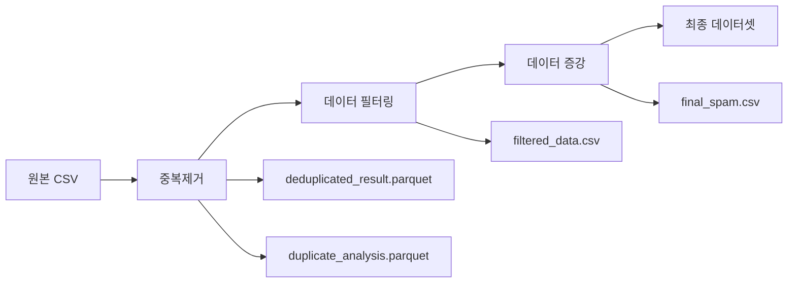

# Data Processing Module

스팸 문자 데이터셋 전처리 및 증강을 위한 모듈들입니다.

## 🔄 데이터 파이프라인 흐름



## 📁 모듈 구성

### 🔧 핵심 모듈

| 파일 | 역할 | 주요 기능 |
|------|------|----------|
| `data_processing.py` | 🎯 메인 파이프라인 | 중복제거 전체 워크플로우 관리 |
| `data_dedup.py` | 🔍 중복 탐지 | Simhash 기반 유사 문서 탐지 |
| `data_filtering.py` | 🎛️ 데이터 필터링 | Gemini API로 복잡도 기반 필터링 |
| `data_argumentation.py` | ✨ 데이터 증강 | Gemini API로 스팸 설명 생성 |
| `data_io.py` | 💾 입출력 처리 | DataFrame 로드/저장/변환 |
| `data_normalize.py` | 🧹 텍스트 정규화 | 전화번호/URL/숫자 마스킹 |

## 🚀 사용법

### 1. 전체 파이프라인 실행
```bash
# 루트 디렉토리에서 실행
./run_data_pipeline.sh

# 특정 CSV 파일로 실행
./run_data_pipeline.sh my_spam_data.csv

# 텍스트 컬럼 지정
./run_data_pipeline.sh --text-col "message"
```

### 2. 단계별 실행
```bash
# 중복제거만 실행
./run_data_pipeline.sh --dedup-only

# 데이터 필터링만 실행
./run_data_pipeline.sh --filter-only

# 데이터 증강만 실행
./run_data_pipeline.sh --aug-only
```

### 3. Python 코드에서 직접 사용
```python
from src.data_pipeline import DataPipeline

# 파이프라인 초기화
pipeline = DataPipeline(
    input_csv_path="./data/spam_dataset.csv",
    output_dir="./src/data"
)

# 전체 파이프라인 실행
pipeline.run_full_pipeline(
    text_col="CN",
    run_dedup=True,
    run_filtering=True,
    run_argumentation=True
)

# 파이프라인 상태 확인
status = pipeline.get_pipeline_status()
print(status)
```

## ⚙️ 주요 알고리즘

### 1. Simhash 중복 탐지
```python
# data_dedup.py
class DuplicateFinder:
    def __init__(self, hamming_distance=3):
        self.hamming_distance = hamming_distance
    
    def find_duplicates(self, texts):
        # Character n-gram 기반 Simhash 생성
        # 해밍 거리로 유사도 측정
        # 중복 문서 탐지 및 제거
```

**특징:**
- Character n-gram (기본값: 2-gram) 사용
- 해밍 거리 임계값: 3 (조정 가능)
- 빈 텍스트 안전 처리
- 메모리 효율적인 인덱싱

### 2. 복잡도 기반 필터링
```python
# data_filtering.py
class DataComplexity(Enum):
    LOW = 0
    MEDIUM = 1
    HIGH = 2
    VERY_HIGH = 3
    EXTREMELY_HIGH = 4
```

**필터링 기준:**
- **HIGH 이상**: 복잡한 스팸 패턴만 학습 데이터로 사용
- **샘플링**: 전체 데이터의 20% 무작위 샘플링
- **Gemini API**: 복잡도 판정을 위한 LLM 활용

### 3. 텍스트 정규화
```python
# data_normalize.py
patterns = {
    "PHONE": r"0\d{1,2}-?\d{3,4}-?\d{4}",
    "URL": r"https?://[^\s]+",
    "NUM": r"\d{1,3}(,\d{3})*"
}
```

**정규화 규칙:**
- 전화번호 → `<phone>`
- URL → `<url>`
- 큰 숫자 → `<num>`
- 소문자 변환 및 공백 정리

## 📊 출력 파일

### 1. 중복제거 결과
```
deduplicated_result.parquet    # 중복 제거된 유니크 데이터
duplicate_analysis.parquet     # 중복 분석 상세 정보
```

### 2. 최종 데이터셋
```
final_spam.csv                 # 학습용 최종 데이터셋
├── CN (컬럼)                 # 원본 스팸 텍스트
├── complexity (컬럼)         # 복잡도 레벨 (필터링 후)
└── output (컬럼)             # Gemini 생성 설명 (증강 후)
```

## 🔧 설정 옵션

### 데이터 설정 (`src/config/data_config.py`)
```python
class DeduplicationConfig:
    TEXT_COL = "CN"                    # 텍스트 컬럼명
    SIMHASH_K = 3                      # 해밍 거리 임계값
    NGRAM_N = 2                        # Character n-gram 크기
    COMPRESSION = "lz4"                # Parquet 압축 방식
```

### 환경 설정 (`.env`)
```bash
GEMINI_API_KEY=your_api_key            # Gemini API 키
GEMINI_MODEL_FILTER=gemini-1.5-flash   # 필터링용 모델
GEMINI_MODEL_ARGU=gemini-1.5-pro       # 증강용 모델
```

## 🧪 테스트

```bash
# 데이터 모듈 테스트
uv run pytest tests/unit/test_data_modules.py -v

# 파이프라인 테스트
uv run pytest tests/unit/test_data_unittest.py -v

# 통합 테스트
uv run pytest tests/integration/ -v
```

## 📈 성능 최적화

### 1. 메모리 최적화
- **Polars**: Pandas 대비 2-3배 빠른 처리
- **Lazy Loading**: 필요한 시점에만 데이터 로드
- **스트리밍**: 대용량 파일 청크 단위 처리

### 2. API 비용 최적화
- **샘플링**: 전체 데이터의 20%만 필터링
- **배치 처리**: API 호출 최소화
- **에러 핸들링**: 실패 시 기본값 사용

### 3. 디스크 최적화
- **Parquet**: 컬럼형 저장으로 압축률 향상
- **LZ4 압축**: 빠른 압축/해제 속도
- **스키마 최적화**: 적절한 데이터 타입 사용

## 🚨 주의사항

### 1. API 사용량
- Gemini API 호출량에 따른 비용 발생
- 일일 요청 한도 확인 필요
- 네트워크 에러 시 재시도 로직 활용

### 2. 데이터 품질
- 입력 CSV 파일의 인코딩: UTF-8 권장
- 필수 컬럼 존재 여부 확인
- 빈 행이나 null 값 처리

### 3. 성능 고려사항
- 대용량 파일(1GB+)의 경우 메모리 사용량 모니터링
- Simhash 인덱스 구축 시간 고려
- SSD 사용 권장 (I/O 성능)

## 🔗 관련 링크

- [Simhash 알고리즘](https://en.wikipedia.org/wiki/SimHash)
- [Polars Documentation](https://docs.pola.rs/)
- [Gemini API Guide](https://ai.google.dev/docs)
- [Character N-gram](https://en.wikipedia.org/wiki/N-gram)
